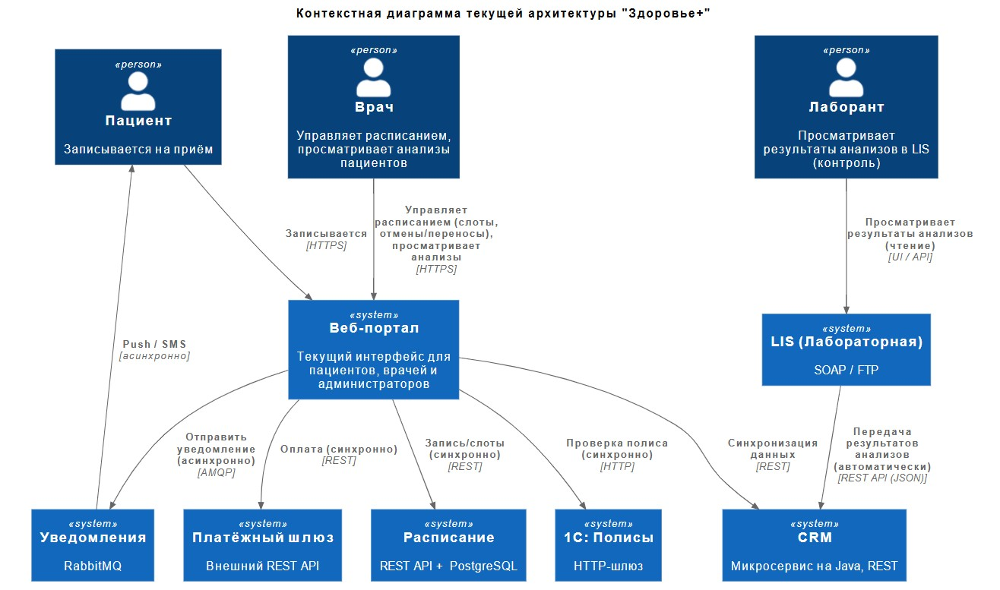
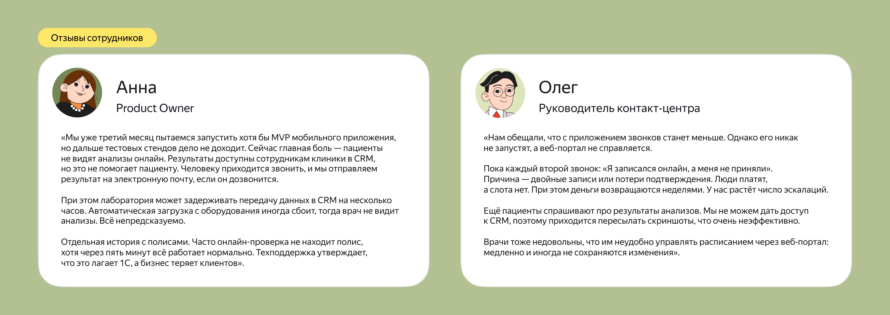
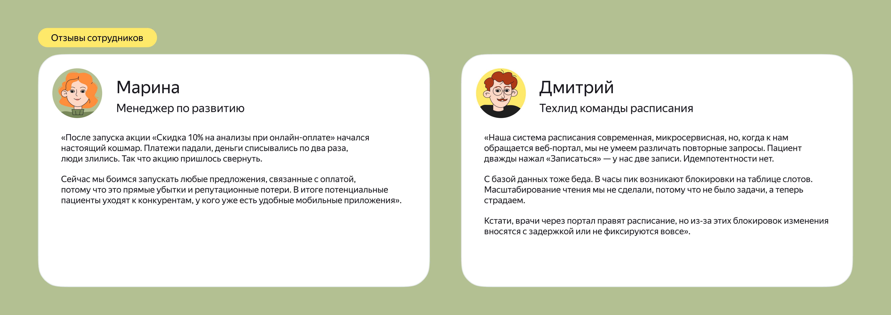
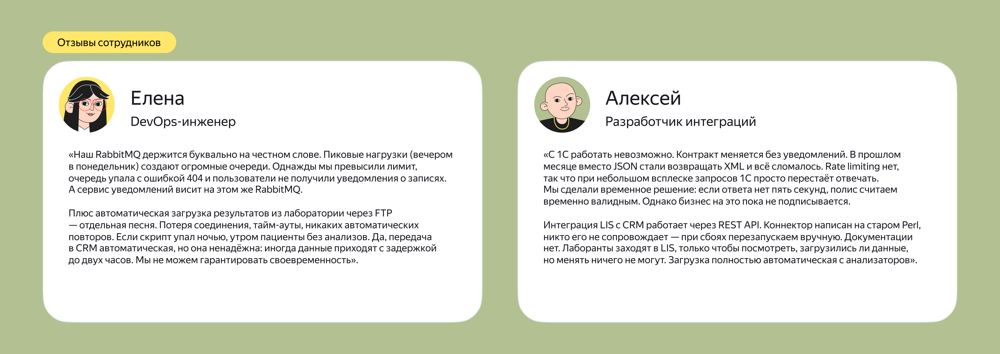
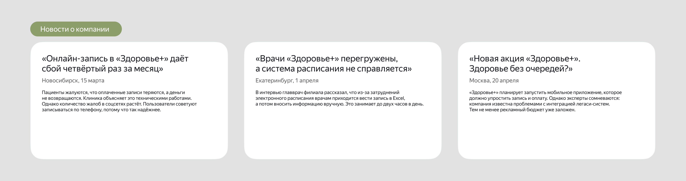

## О компании 

Бизнес-модель «Здоровья+» сочетает платные услуги (консультации, диагностику и операции) и услуги по ДМС. Ключевые бизнес‑процессы: запись пациентов, лабораторная диагностика, выписка рецептов, оплата, коммуникация (уведомления, результаты исследований и тд.).

Последний год компания активно растёт. У неё открылись пять новых центров, а количество уникальных пациентов увеличилось на 40%. Это вызвало резкий рост нагрузки на ИТ‑системы, которые исторически развивались фрагментарно. Часть систем (расписание и CRM) уже перешла на микросервисы, но остальная архитектура (лабораторная система и учёт полисов на 1С) осталась Legacy.

## Цели бизнеса 

Руководство «Здоровья+» решило запустить мобильное приложение для пациентов, которое должно поддержать сценарии:
- Запись к врачу онлайн;
- Получение результатов анализов без звонка в клинику;
- Оплата услуг;
- Управление полисами ДМС;
- Пуш‑уведомления о статусе записи, готовности анализов и акциях.

**Через три месяца промежуточное решение (MVP)** должно запустить приложение с базовыми функциями (запись, оплата, уведомления), на 30% снизить нагрузку на колл‑центр за счёт самозаписи и обеспечить стабильную работу при пиковой нагрузке в 500 одновременных пользователей вечерами и в выходные. 
**Финальное решение (через год)** подразумевает, что доля онлайн-записи достигнет 70% от общего числа визитов, средний чек вырастет благодаря дополнительным услугам, предлагаемым в приложении, в часы пик оно будет способно выдерживать до 50 тысяч пользователей, а время отклика составит меньше одной секунды для 99% запросов, доступность 99,95% и горизонтальное масштабирование всех компонентов.

## Текущий ИТ-ландшафт
Существующие ИТ-системы и потоки данных представлены на диаграмме контекста С4 (Level 1): 

## Технологический стек и функции систем
| ИТ-система | Функции | Технологии |
|---|---|---|
|Расписание|Управление слотами врачей, запись пациентов, подтверждение и отмена записей|Java, REST, PostgreSQL|
|CRM|Ведение карточек пациентов, контактной информации, истории обращений. Содержит результаты анализов (из LIS)|Java, REST, PostgreSQL|
|LIS (лабораторная)|Хранение результатов анализов, автоматический приём данных с оборудования, передача результатов в CRM через REST API. Доступна лаборантам только для просмотра|SOAP, FTP для загрузки данных с оборудования, REST API для интеграции и передачи данных|
|1С: Полисы|Проверка валидности полиса ДМС, прикрепление полиса к пациенту|1С:Предприятие, HTTP-шлюз|
|Платёжный шлюз|Проведение онлайн-платежей (внешний поставщик)|REST API (синхронный)|
|Уведомления|Отправка электронных писем, смс и пушей|RabbitMQ и внешние провайдеры электронной почты, смс и пушей|

Для понимания текущего состояния системы из различных источников собрали информацию.

## Выгрузка из bug-трекинга (Jira)

| Jira    | ID   | Тип      | Приоритет            | Компонент                                                                                                              | Краткое описание |
|---------|------|----------|----------------------|------------------------------------------------------------------------------------------------------------------------|------------------|
| INT-001 | Bug  | Blocker  | Платёжный шлюз       | При таймауте деньги списываются, статус платежа не фиксируется                                                         |
| INT-002 | Bug  | Major    | LIS                  | Автоматическая загрузка через FTP падает с 425, требуется ручное восстановление. Задержка передачи в CRM до двух часов |
| INT-003 | Bug  | Critical | 1С                   | Проверка полиса падает с 503 на пиках ( >50 rps)                                                                       |
| INT-004 | Task | Minor    | Уведомления          | Документировать лимиты RabbitMQ                                                                                        |
| INT-005 | Bug  | Blocker  | Расписание           | Отсутствие идемпотентности — дубли записей при повторных POST                                                          |
| INT-006 | Bug  | Major    | Веб-портал           | SQL-инъекция в поле поиска пациента                                                                                    |
| INT-007 | Bug  | Critical | Интеграция (общее)   | Отсутствие distributed tracing – сложно найти корень сбоя                                                              |
| INT-008 | Bug  | Major    | LIS                  | Дублирование XML-файлов (сбой при передаче). В CRM попадают дубли анализов                                             |
| INT-009 | Task | Major    | Расписание           | Репликация базы данных для чтения (блокировки)                                                                         |
| INT-010 | Epic | Critical | Мобильное приложение | Разработать API Gateway с rate limiting и идемпотентностью при внедрении                                               |
| INT-011 | Bug  | Major    | CRM                  | Неактуальные анализы (LIS передал, а CRM не обновила — застряло в очереди)                                             |

## Тикеты в службе поддержки (Service Desk)

| ID     | Дата  | Тема                                                                  | Описание                                                                                                    | Статус      |
|--------|-------|-----------------------------------------------------------------------|-------------------------------------------------------------------------------------------------------------|-------------|
| SD-001 | 10.02 | Зависает проверка полиса                                              | Администраторы жалуются, что 1С иногда отвечает дольше 30 секунд, а помогает только перезагрузка службы     | Resolved    |
| SD-002 | 15.02 | Не приходит подтверждение записи                                      | Пациент оплатил, подтверждение не пришло. В логах ошибка «Booking not found для paymentID»                  | Open        |
| SD-003 | 20.02 | Дубль записи на один слот                                             | Пациент дважды нажал «Записаться», и образовалось две записи                                                | Closed      |
| SD-004 | 25.02 | Зависание при оплате                                                  | При оплате мобильное приложение (тестовая версия) виснет на десять секунд, после чего выдаёт ошибку         | Resolved    |
| SD-005 | 01.03 | Утром не видны анализы в CRM, загруженные ночью                       | Оказалось, что FTP-скрипт падал из-за таймаута, REST-коннектор не переотправил — пришлось запускать вручную | Closed      |
| SD-006 | 10.03 | Не приходит пуш-уведомление на андроид                                | Очередь RabbitMQ была переполнена из-за пиковой нагрузки                                                    | Resolved    |
| SD-007 | 20.03 | Врач видит чужого пациента                                            | Возможно, подмена сессии (security issue)                                                                   | In Progress |
| SD-008 | 30.03 | При попытке записи появляется «Полис недействителен», хотя нормальный | 1С вернул null, через пять минут повтор – успех                                                             | Closed      |
| SD-009 | 05.04 | Двойное списание денег                                                | Дважды списали деньги при оплате                                                                            | In Progress |

## Что нужно сделать

Проектная работа состоит из четырёх заданий. Вам предстоит спроектировать целевую интеграционную архитектуру для внедрения мобильного приложения для «Здоровье+». Архитектура должна учитывать разнородность ИТ-систем, обеспечивать отказоустойчивость, масштабируемость и безопасность. 

В результате должен получиться пакет документов по каждому из заданий, который поможет достичь целевого состояния мобильного приложения «Здоровья+».

Проект этого спринта вы будете сдавать в Git-репозитории. Создайте публичный репозиторий в GitHub и назовите его Solution-Health.  

Решение каждого задания нужно будет залить в отдельную директорию. Создайте в репозитории восемь директорий: «Task1», «Task2», «Task3.1», «Task3.2», «Task3.3», «Task4.1», «Task4.2» и «Task4.3».

Чтобы ревьюеру было проще проверять вашу работу, а вам отслеживать изменения на разных итерациях, загрузите файлы в свой репозиторий и сделайте пул-реквест. На ревью нужно отправить ссылку на пул-реквест.

### Задание 1. Анализ текущей интеграционной архитектуры

**Цель задания:** описать системные проблемы и риски, которые могут помешать успешному запуску мобильного приложения. 

Сфокусируйтесь на надёжности интеграций, масштабируемости и других важных вещах для успешного внедрения мобильного приложения.

Оформите результат в виде списка выявленных проблем. Для каждой составьте описание и список артефактов, которые её подтверждают, а также приведите потенциальное влияние конкретной проблемы на мобильное приложение. 

Результат оформите в виде таблице, состоящей из колонок: проблема, признаки и влияние на приложение.

Загрузите получившуюся таблицу в директорию Task1 вашего репозитория.

---

### Задание 2. Целевая интеграционная архитектура

**Цель задания:** спроектировать целевую интеграционную архитектуру ИТ-ландшафта «Здоровья+» для успешного внедрения мобильного приложения. 

В результате у вас должна получиться целевая контекстная диаграмма (C4 Level 1). На ней отразите:
- Мобильное приложение как новый актор;
- Существующие ИТ-системы;
- Все остальные ИТ-системы, которые вы посчитаете необходимыми для внедрения мобильного приложения;
- Типы интеграционных взаимодействий и потоки данных.

Для каждой новой интеграции укажите, почему вы выбрали именно этот паттерн, какие архитектурные стили вы использовали и почему. В случае комбинации, пропишите, как именно.

Загрузите получившуюся диаграмму в директорию Task2 вашего репозитория.

---

### Задание 3. Проектирование ключевых архитектурных решений для интеграции ИТ-систем

Это задание состоит из трёх подзадач. 

#### 3.1. Надёжная поставка результатов анализов в мобильное приложение

**Цель задания:** спроектировать архитектуру доставки результатов анализов в мобильное приложение, обеспечив гарантированный процесс и минимальную задержку.

Как вы знаете из интервью сотрудников «Здоровье+», пациенты не видят результаты своих анализов в онлайн-режиме. Лабораторная информационная система (LIS) передаёт данные в CRM с задержками. Да и в целом весь этот процесс весьма не надёжен: файлы теряются, а записи дублируются. Лаборанты не могут влиять на автоматическую загрузку. В результате врачи получают неактуальные данные, а пациенты вынуждены звонить в колл-центр, так что их доверие теряется. 

Вам нужно сравнить разные способы реализации доставки результатов анализов в приложение и выбрать решение, которое будет учитывать гарантированную доставку, поддерживать пиковую нагрузку и простоту эксплуатации. 

Также подготовьте схему потока данных с момента готовности результата в LIS до их появления в приложении.

В результате у вас должно получиться: 
- Текстовое описание решения;
- Таблица сравнения, где вы обосновывайте свой выбор архитектурного решения и инструментов реализации;
- Блок-схема потока данных.

Загрузите получившиеся артефакты в директорию Task3.1 вашего репозитория.

#### 3.2. Автоматизация бизнес-операции «Запись к врачу с оплатой и резервированием сдачи анализов»
**Цель задания:** спроектировать отказоустойчивый сценарий, который будет включать бронирование слота записи и лабораторного исследования, проверку полиса и оплату. 

Основная функция приложения — запись на приём. Однако сейчас она работает нестабильно, из-за чего пациенты и сталкиваются с дублированием записей, потерей подтверждений и двойными списаниями денег. 

После успешной оплаты консультации часто требуется зарезервировать время для забора биоматериалов в лаборатории (LIS), что добавляет ещё один шаг в и без того сложный процесс. При этом у существующей синхронной цепочки вызовов нет механизмов отката при сбоях. 

Выполнение задания начните с оформления успешного сценария, когда все шаги проходят без сбоев и составьте диаграмму последовательности (UML Sequence Diagram), после чего выберите тип SAGA и обоснуйте этот  выбор в рассматриваемом сценарии. 

Для трёх ключевых шагов (например, бронирования слота записи) определите компенсирующие транзакции. Оформите всё в таблицу, которая будет состоять из трёх колонок: шаг сценария, компенсирующее действие и риск, который устраняется. 

Также предложите механизм, как обеспечить идемпотентность на входе.

В результате у вас должен получиться набор артефактов: 
- Диаграмма последовательности (UML Sequence Diagram) для успешного сценария.
- Текстовое описание решения, где в трёх-четырёх предложениях обоснуйте выбор типа SAGA;
- Таблица с определением компенсирующих транзакций.
- Текстовое описание механизма обеспечения идемпотентности.

Загрузите получившиеся артефакты в директорию Task3.2 вашего репозитория.

#### 3.3. API для мобильного приложения (OpenAPI)

**Цель задания:** разработать спецификацию OpenAPI (Swagger) для одного из ключевых endpoints мобильного приложения — получения пациентом списка своих предстоящих записей к врачу.

Для интеграции мобильного приложения с ИТ-системами необходимы надёжные и безопасные контракты API. Сотрудники жалуются на отсутствие документации и нестабильность существующих endpoints.

Вам нужно:
- Определить ресурс (/appointments), HTTP-метод и структуру базового ответа;
- Добавить параметры для фильтрации (например, status=upcoming) и реализовать пагинацию (параметры limit и offset);
- Указать требование аутентификации и описать три основных HTTP-кода ответа (200, 401, 500) с примерами.

В результате у вас должна получиться спецификация в формате YAML (фрагмент OpenAPI 3.2) и краткий комментарий с объяснением выбранного подхода к пагинации и версионированию API (например, версия в URL /api/v1/...).

Загрузите спецификацию и комментарий в директорию Task3.3 вашего репозитория.

---

### Задание 4. Отказоустойчивость, масштабируемость и безопасность

Это задание также состоит из трёх подзадач.

#### 4.1. Реализация отказоустойчивости интеграции между ИТ-системами

**Цель задания:** определить конкретные параметры и стратегии применения паттернов отказоустойчивости для вызовов к 1С и платёжному шлюзу.

Критически важные для бизнеса системы 1С («Полисы») и внешний платёжный шлюз — постоянные источники сбоев. 1С периодически не выдерживает нагрузку больше 50 RPS и может зависать больше чем на 30 секунд. Платёжный шлюз при таймаутах приводит к списанию денег без фиксации статуса. 

Поэтому для каждой из двух систем (1С и платёжный шлюз) предложите и обоснуйте значения таймаута в секундах, стратегии повторных попыток (в частности, количество попыток и интервал) и действие при fallback. 

Ещё вам нужно обосновать, для какой из двух ИТ-систем паттерн Circuit Breaker более критически важен и почему, и объяснить механизм его работы. 

Кроме того, предложите одно архитектурное решение, которое снизит нагрузку на 1С.

В результате у вас должно получиться: 
- Таблица с параметрами для 1С и платёжного шлюза;
- Обоснование выбора ИТ-системы для приоритетного внедрения Circuit Breaker;
- Описание архитектурного решения для снижения нагрузки на 1С (диаграмма С4 Level 1).

Загрузите получившиеся артефакты в директорию Task4.1 вашего репозитория.  

#### 4.2. Стратегия горизонтального масштабирования

**Цель задания:** определить две наиболее критичные ИТ-системы компании и разработать для них план горизонтального масштабирования с точки зрения новой нагрузки. 

Основная цель «Здоровья+» — обслуживать 50 тысяч пользователей в часы пик с откликом менее одной секунды. У текущей архитектуры есть узкие места, которые нельзя горизонтально масштабировать. 

Для каждой ИТ-системы опишите реализацию горизонтального масштабирования и укажите по одному ключевому ограничению выбранного метода и одному возможному решению, связанного с этим ограничением.

В результате у вас должна получиться таблица, которая будет состоять из четырёх столбцов: ИТ-система, реализация горизонтального масштабирования, ограничение и описание решения для него.

Загрузите получившуюся таблицу в директорию Task4.2 вашего репозитория. 

#### 4.3. Проектирование базовых мер безопасности

**Цель задания:** спроектировать фундаментальные меры безопасности для взаимодействия мобильного приложения с ИТ-системами.

В ИТ-системах «Здоровья+» уже обнаружены проблемы безопасности. В частности, SQL-инъекция и возможная подмена сессии. Новое мобильное приложение, обрабатывающее персональные и медицинские данные также станет привлекательной целью для атак, поэтому изначально в него нужно заложить основы безопасной интеграции.

Для этого: 
- Предложите схему аутентификации пользователей мобильного приложения и указать протокол и способ передачи токена. 
- Определите политики Rate Limiting для публичного запроса «Поиск врачей» и авторизованного запроса «Создание записи к врачу», а также укажите лимиты и действие при их превышении.
- Пропишите обязательные меры по защите данных при передаче между мобильным приложением и ИТ-системами.

В результате у вас должен получиться набор артефактов: 
- Описание схемы аутентификации пользователей мобильного приложения и сама схема.
- Таблица политики Rate Limiting, состоящая из колонок: тип запроса, лимит и действие при превышении.
- Список мер защиты каналов передачи данных.
- Загрузите получившиеся артефакты в директорию Task4.3. вашего репозитория.

---

## Как сдать работу

В директории Task1 должна лежать Таблица со списком выявленных проблем.   

В директории Task2 — контекстная диаграмма C4.

В директории Task3.1 — текстовое описание реализации доставки результатов анализов в приложение и выбранное решение, которое будет учитывать гарантированную доставку, поддерживать пиковую нагрузку и простоту эксплуатации, таблицу сравнения и блок-схему потока данных.

В директории Task3.2 — текстовое описание решения с обоснованием выбора типа SAGA, таблица с определением компенсирующих транзакций, диаграмма последовательности для успешного сценария и текстовое описание механизма обеспечения идемпотентности.

В директории Task3.3 — спецификация в формате YAML (фрагмент OpenAPI 3.0) и краткий комментарий с объяснением выбранного подхода к пагинации и версионированию API.

В директории Task4.1 — таблица с параметрами для 1С и платёжного шлюза, обоснование выбора ИТ-системы для приоритетного внедрения Circuit Breaker и описание архитектурного решения для снижения нагрузки на 1С с диаграммой С4 Level 1.

В директории Task4.2 — таблица с реализацией горизонтального масштабирования и указанием по одному ключевому ограничению выбранного метода и одному возможному решению, связанного с этим ограничением.

В директории Task4.3 — описание схемы аутентификации пользователей мобильного приложения и сама схема, таблица политики Rate Limiting и список мер защиты каналов передачи данных.

Перед отправкой решения проверьте, что вы включили в пул-реквест все нужные файлы. Если всё готово, то отправьте ссылку на пул-реквест во вкладке «Ревью».

Не забудьте убедиться, что репозиторий публичный. Если создадите приватный, ревьюер не сможет прокомментировать ваше решение и вернёт его на доработку.

После того как отправите ссылку, не вносите изменения в проект. Дождитесь комментариев ревьюера.