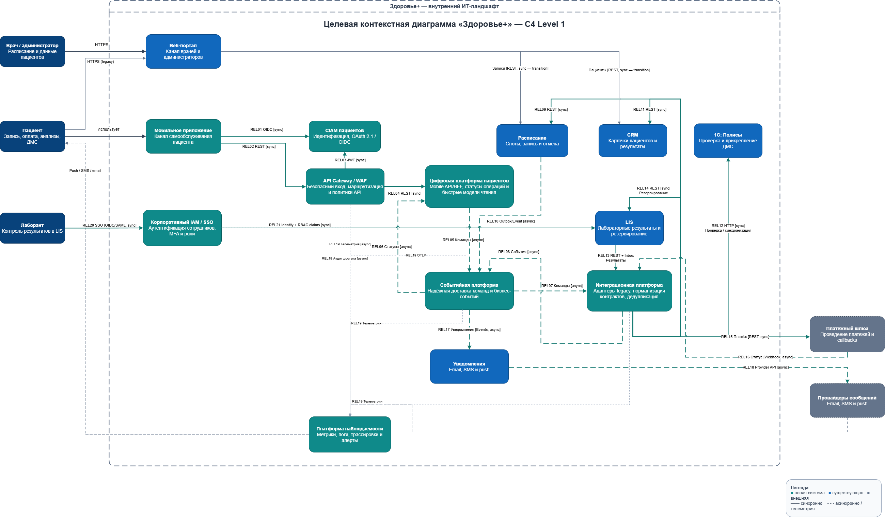

# Задание 2. Целевая интеграционная архитектура

## Диаграмма

Редактируемый исходник: [target-architecture.drawio](target-architecture.drawio).

Диаграмма выполнена на уровне C4 Context. Мобильное приложение показано как software system, а пациент — как person, который использует его. Внутренние базы данных, очереди и отдельные микросервисы намеренно не вынесены на диаграмму: это детали C4 Container и последующих заданий.

## Выбранный подход

Целевая архитектура сочетает синхронный API-контур и Event-Driven Architecture:

- синхронный HTTPS/REST используется для аутентификации, быстрых запросов чтения и принятия пользовательских команд;
- асинхронные события используются для длительных сквозных операций, доставки изменений статусов, результатов анализов и уведомлений;
- мобильное приложение не обращается к legacy-системам напрямую: API Gateway и интеграционная платформа изолируют их контракты и сбои;
- веб-портал сохраняется как канал врачей и администраторов на переходный период, но перестаёт быть единственным интеграционным центром.

Такой гибрид выбран вместо двух крайних вариантов:

1. Синхронный API-фасад проще для MVP, но сохраняет каскадные отказы и зависимость p99 от 1С, LIS и платёжного шлюза.
2. Полностью событийная декомпозиция лучше изолирует домены, но требует миграции владения данными и нереалистична для запуска за три месяца.

Гибридный вариант позволяет постепенно внедрять новый контур по паттерну Strangler Fig, сохраняя существующие системы источниками данных. Требование p99 менее одной секунды относится к чтению и принятию команды API; завершение асинхронной бизнес-операции должно иметь отдельный SLO и отображаться пользователю через статус.

## Новые системы

Идентификаторы `ARCH-S-NNN` обозначают системы целевой архитектуры, где `S` означает system.

| ID | Система | Ответственность | Закрываемые проблемы |
|---|---|---|---|
| `ARCH-S-001` | Мобильное приложение | Самообслуживание пациента: запись, оплата, анализы, ДМС и уведомления | Новый цифровой канал |
| `ARCH-S-002` | CIAM пациентов | Аутентификация пациентов и выдача токенов по OAuth 2.1 / OIDC | `ARCH-I-011` |
| `ARCH-S-003` | API Gateway / WAF | Единый защищённый вход, проверка токена, маршрутизация и политики API | `ARCH-I-001`, `ARCH-I-004`, `ARCH-I-011` |
| `ARCH-S-004` | Цифровая платформа пациентов | Mobile API/BFF, принятие команд, быстрые модели чтения и статусы сквозных операций | `ARCH-I-001`, `ARCH-I-003`, `ARCH-I-005` |
| `ARCH-S-005` | Интеграционная платформа | Адаптеры legacy, нормализация контрактов, дедупликация и изоляция внешних сбоев | `ARCH-I-002`, `ARCH-I-006`, `ARCH-I-007`, `ARCH-I-010` |
| `ARCH-S-006` | Событийная платформа | Надёжная доставка команд и бизнес-событий, буферизация пиков и развязка потребителей | `ARCH-I-002`, `ARCH-I-003`, `ARCH-I-007`, `ARCH-I-008` |
| `ARCH-S-007` | Платформа наблюдаемости | Централизованные метрики, логи, distributed tracing и алерты | `ARCH-I-009` |
| `ARCH-S-008` | Корпоративный IAM / SSO | Единая аутентификация сотрудников, жизненный цикл учётных записей и передача ролей для авторизации в LIS | `ARCH-I-011` |

## Обоснование новых интеграций

Идентификаторы `ARCH-REL-NNN` обозначают отношения между системами целевой архитектуры, где `REL` означает relationship.

| ID | Интеграция и данные | Тип взаимодействия | Паттерн / архитектурный стиль | Почему выбран | Трассировка |
|---|---|---|---|---|---|
| `ARCH-REL-001` | Мобильное приложение → CIAM пациентов: вход пользователя и обновление токена | Синхронно, OIDC/OAuth 2.1 Authorization Code + PKCE | Federated Identity, Token-based Authentication | Отделяет управление учётными данными от бизнес-API; PKCE защищает публичный мобильный клиент, который не может безопасно хранить client secret | `ARCH-I-011` |
| `ARCH-REL-002` | Мобильное приложение → API Gateway/WAF: запросы записи, оплаты, анализов и ДМС | Синхронно, HTTPS/REST | API Gateway | Даёт мобильному каналу единую точку входа без прямого доступа к CRM, 1С, LIS и расписанию | `ARCH-I-001`, `ARCH-I-011` |
| `ARCH-REL-003` | API Gateway/WAF → CIAM пациентов: проверка access token | Синхронно по JWT/JWKS с локальным кешированием ключей | Token Validation, Cache-Aside | Локальная криптографическая проверка JWT не создаёт сетевой вызов к CIAM на каждый запрос и снижает риск нового узкого места | `ARCH-I-002`, `ARCH-I-005`, `ARCH-I-011` |
| `ARCH-REL-004` | API Gateway/WAF → цифровая платформа пациентов: версионированный Mobile API | Синхронно, HTTPS/REST | Backend for Frontend, API-led Integration | BFF возвращает данные в форме мобильного UI и не раскрывает внутренние контракты backend-систем | `ARCH-I-001`, `ARCH-I-010` |
| `ARCH-REL-005` | Цифровая платформа → событийная платформа: команды записи, оплаты, проверки полиса | Асинхронно, сообщения | Event-Driven Architecture, Asynchronous Command | Быстро подтверждает принятие длительной операции, буферизует пики и не удерживает мобильное соединение во время вызовов legacy | `ARCH-I-002`, `ARCH-I-003`, `ARCH-I-005` |
| `ARCH-REL-006` | Событийная платформа → цифровая платформа: статусы операций и обновление проекций | Асинхронно, события | Event Notification, CQRS / Materialized View | Пользователь читает подготовленное состояние без синхронного fan-out по legacy-системам; eventual consistency явно выражена статусом операции | `ARCH-I-001`, `ARCH-I-003`, `ARCH-I-005` |
| `ARCH-REL-007` | Событийная платформа → интеграционная платформа: команды legacy-адаптерам | Асинхронно, сообщения | Competing Consumers, Load Leveling | Позволяет независимо масштабировать обработчики и ограничивать фактическую нагрузку на 1С, LIS и платёжный шлюз | `ARCH-I-002`, `ARCH-I-005`, `ARCH-I-006` |
| `ARCH-REL-008` | Интеграционная платформа → событийная платформа: нормализованные результаты и доменные события | Асинхронно, события | Adapter / Anti-Corruption Layer, Event-Driven Architecture | Скрывает нестабильные legacy-форматы и предоставляет потребителям единый версионируемый контракт событий | `ARCH-I-006`, `ARCH-I-007`, `ARCH-I-010` |
| `ARCH-REL-009` | Интеграционная платформа → Расписание: слоты, создание и отмена записи | Синхронно, REST с `Idempotency-Key` | Adapter, Idempotent Request | Сценарий требует немедленного ответа о резервировании слота; стабильный ключ делает безопасным повтор после сетевого сбоя | `ARCH-I-003`, `ARCH-I-004` |
| `ARCH-REL-010` | Расписание → событийная платформа: изменение записи и слотов | Асинхронно, события | Transactional Outbox, Event Notification | Исключает потерю события между фиксацией записи и публикацией статуса, не связывая новых потребителей с БД расписания | `ARCH-I-003`, `ARCH-I-005` |
| `ARCH-REL-011` | Интеграционная платформа → CRM: профиль пациента и результаты | Синхронно, REST | Anti-Corruption Layer, Request/Response | Адаптер сохраняет существующий CRM источником данных, но не раскрывает его контракт мобильному контуру; изменения для остальных потребителей затем публикуются через `ARCH-REL-008` | `ARCH-I-001`, `ARCH-I-007`, `ARCH-I-010` |
| `ARCH-REL-012` | Интеграционная платформа ↔ 1С: Полисы: проверка и контролируемая синхронизация ДМС | Ограниченные синхронные HTTP-вызовы и асинхронное обновление локальной проекции | Adapter, Cache-Aside, Eventual Consistency | Локальная проекция снижает нагрузку на предел 1С в 50 RPS и сохраняет доступность чтения при временном сбое; изменение полиса сверяется с источником | `ARCH-I-002`, `ARCH-I-006`, `ARCH-I-010` |
| `ARCH-REL-013` | LIS → интеграционная платформа: готовые результаты с уникальным `resultId` | REST-приём с последующей асинхронной публикацией | Persistent Inbox, Idempotent Consumer, Anti-Corruption Layer | Inbox подтверждает приём только после сохранения, а `resultId` позволяет безопасно повторять доставку без дублей | `ARCH-I-007` |
| `ARCH-REL-014` | Интеграционная платформа → LIS: резервирование лабораторного исследования | Синхронно, REST через адаптер | Adapter, Request/Response | Результат резервирования нужен сквозной операции; адаптер изолирует платформу от SOAP/FTP и изменений LIS | `ARCH-I-003`, `ARCH-I-010` |
| `ARCH-REL-015` | Интеграционная платформа → платёжный шлюз: создание платежа с уникальным ключом операции | Синхронно, REST | Idempotent Request, Payment Intent | Пользователь получает реквизиты платежа, а уникальный ключ не допускает повторного списания при повторе запроса | `ARCH-I-002`, `ARCH-I-003`, `ARCH-I-004` |
| `ARCH-REL-016` | Платёжный шлюз → интеграционная платформа: финальный статус платежа | Асинхронно, подписанный webhook | Asynchronous Callback, Idempotent Consumer | Отделяет технический таймаут исходного REST-вызова от фактического финансового результата и поддерживает сверку статуса | `ARCH-I-002`, `ARCH-I-003` |
| `ARCH-REL-017` | Событийная платформа → Уведомления: запись, платёж, готовность анализа | Асинхронно, события | Publish/Subscribe | Бизнес-операция не ждёт внешних email/SMS/push-провайдеров; несколько каналов могут независимо подписываться на событие | `ARCH-I-002`, `ARCH-I-008` |
| `ARCH-REL-018` | Уведомления → внешние провайдеры сообщений | Асинхронная обработка через API провайдеров | Store and Forward, Retryable Delivery | Временная недоступность конкретного провайдера не должна терять уведомление или блокировать основной сценарий | `ARCH-I-002`, `ARCH-I-008` |
| `ARCH-REL-019` | CIAM, корпоративный IAM/SSO, API Gateway, цифровая, интеграционная и событийная платформы → платформа наблюдаемости | Асинхронная телеметрия и аудит, OpenTelemetry/OTLP | Centralized Observability, Correlation ID, Security Audit Trail | Общий trace/correlation ID связывает мобильный запрос, сообщения и legacy-вызовы, а события IAM обеспечивают аудит входов и изменений доступа | `ARCH-I-009`, `ARCH-I-011` |
| `ARCH-REL-020` | Лаборант → корпоративный IAM/SSO: вход сотрудника | Синхронно, OIDC или SAML 2.0 через корпоративную сеть | Enterprise SSO, Federated Identity | Убирает локальные пароли LIS, позволяет централизованно блокировать уволенных сотрудников и применять MFA для доступа к медицинским данным | `ARCH-I-011` |
| `ARCH-REL-021` | Корпоративный IAM/SSO → LIS: подтверждённая личность и роли лаборанта | Синхронно, OIDC claims или SAML assertion | RBAC, Least Privilege, Policy Enforcement Point | LIS авторизует просмотр результатов по корпоративным ролям; IAM подтверждает личность, а решение о доступе к конкретным данным остаётся в LIS и журналируется | `ARCH-I-011` |

## Как комбинируются архитектурные стили

1. **API-led integration** образует внешний синхронный слой: Mobile App → API Gateway → BFF. Он отвечает за быстрые чтения, валидацию запроса и принятие команды.
2. **Event-Driven Architecture** образует внутренний асинхронный слой: команды и события проходят через событийную платформу, а обработчики масштабируются независимо.
3. **Anti-Corruption Layer** находится на границе с каждой legacy- или внешней системой и преобразует её контракт в каноническую модель платформы.
4. **CQRS на уровне интеграции** разделяет пользовательское чтение и выполнение команд: чтение обслуживается из проекций, а источниками истины остаются расписание, CRM, LIS и 1С.
5. **Strangler Fig** обеспечивает переход: веб-портал продолжает работать, а новые пациентские сценарии постепенно переводятся в новый API-контур.
6. **Разделение Customer IAM и Workforce IAM** изолирует публичные учётные записи пациентов от корпоративных идентичностей сотрудников. Лаборант проходит SSO, а LIS применяет RBAC и принцип наименьших привилегий по полученным claims.

## Связь с архитектурными драйверами

| Драйвер | Как учитывается |
|---|---|
| MVP за три месяца | Эволюционное внедрение без полной замены CRM, LIS, 1С и расписания |
| 500 пользователей MVP | Stateless API-контур и буферизация пиков событийной платформой |
| До 50 000 пользователей | Горизонтальное масштабирование Gateway, BFF и обработчиков; чтение из проекций вместо fan-out |
| p99 < 1 с | Быстрые синхронные чтения и ответ о принятии длительной команды; завершение операции асинхронно |
| Доступность 99,95% | Изоляция legacy-отказов, асинхронная доставка, локальные проекции и отсутствие прямых вызовов из приложения |
| Безопасность медицинских данных | OIDC/OAuth 2.1 для пациентов, корпоративный SSO и RBAC для сотрудников, WAF, проверка токенов и отсутствие прямого доступа мобильного клиента к внутренним системам |
| Сопровождаемость | Версионируемые контракты, адаптеры и централизованная наблюдаемость |

Количество пользователей само по себе не определяет требуемую мощность. Перед запуском необходимо зафиксировать профиль RPS, долю чтений и команд, размеры сообщений и SLO завершения асинхронных операций, а затем подтвердить их нагрузочными и failover-тестами.
