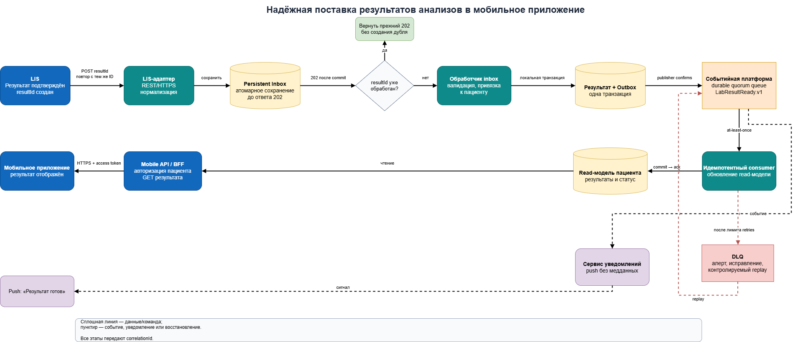

# Задание 3.1. Надёжная поставка результатов анализов

## Выбранное решение

Для доставки результатов используется событийный поток с семантикой **at-least-once** и идемпотентной обработкой. Абсолютную гарантию «ровно один раз» между независимыми системами обеспечить нельзя: при потере подтверждения отправитель обязан повторить запрос. Поэтому надёжность достигается сочетанием persistent inbox, transactional outbox, персистентной очереди и дедупликации по глобально уникальному `resultId`.

После финального подтверждения результата LIS отправляет канонический JSON по HTTPS в адаптер интеграционной платформы. Для переходного периода тот же адаптер может забирать XML из существующего FTP-каталога, но после нормализации дальнейший поток не зависит от способа получения. Адаптер в одной локальной транзакции сохраняет результат в inbox и возвращает `202 Accepted` только после фиксации на диске. Повтор с тем же `resultId` возвращает прежний результат приёма и не создаёт второй анализ.

Обработчик inbox проверяет схему, антивирусные и размерные ограничения, связывает результат с пациентом и в одной транзакции сохраняет нормализованный результат вместе с записью outbox. Outbox relay публикует событие `LabResultReady.v1` в персистентную очередь. Цифровая платформа пациентов идемпотентно обновляет собственную read-модель, из которой Mobile API/BFF отдаёт данные приложению. Отдельный подписчик создаёт push-уведомление; push сообщает только о появлении результата и не содержит медицинских данных. После уведомления приложение получает актуальный результат через авторизованный `GET` к BFF.

## Сравнение вариантов

| Вариант | Гарантия и дубли | Пиковая нагрузка | Эксплуатация | Вывод |
|---|---|---|---|---|
| FTP/XML по расписанию | Файл может потеряться между копированием и обработкой; подтверждение бизнес-обработки отсутствует; повторы создают дубли | Каталог и пакетный импорт образуют ночные пики, нет управляемого backpressure | Текущий Perl-коннектор не сопровождается, восстановление ручное | Оставить только как временный вход через новый адаптер |
| Прямой синхронный REST LIS → CRM/BFF | Можно добавить `resultId`, но таймаут создаёт неопределённый исход; доступность получателя влияет на LIS | Получатель должен выдержать весь пик, буферизации нет | Мало компонентов, но сложные повторы и каскадные отказы | Недостаточно надёжно для сквозного процесса |
| REST → persistent inbox → очередь → read-модель | At-least-once; inbox/outbox исключают потерю между приёмом, БД и публикацией; `resultId` устраняет дубли | Персистентная очередь буферизует пик, consumers масштабируются горизонтально | Требует брокера и мониторинга, зато даёт единый replay, DLQ и понятный статус сообщения | **Выбранный вариант** |
| CDC из БД LIS | Не требует изменения приложения LIS, журнал изменений можно повторно прочитать | Хорошо выдерживает поток, но создаёт нагрузку на журнал и коннектор | Сильная связь со схемой и СУБД LIS; изменения таблиц могут незаметно сломать контракт | Резервный вариант, если LIS невозможно доработать |

Для MVP используется существующая компетенция по RabbitMQ, но в отдельном отказоустойчивом кластере с quorum queues, publisher confirms, durable messages и документированными лимитами. Это проще внедрить за три месяца, чем отдельный Kafka-контур. Если долговременный replay и объём потока перерастут возможности очереди, контракт `LabResultReady.v1` позволяет заменить реализацию событийной платформы без изменения LIS и мобильного API.

## Обработка сбоев и эксплуатация

1. **Повтор входного запроса.** LIS повторяет только после таймаута или ответа `5xx`, используя тот же `resultId`; для `4xx` повтор запрещён до исправления данных.
2. **Повтор обработки.** Consumers подтверждают сообщение только после фиксации своей транзакции. Применяется exponential backoff с jitter и ограниченным числом автоматических попыток.
3. **Неразрешимая ошибка.** Сообщение попадает в DLQ вместе с кодом ошибки, `resultId`, `correlationId` и числом попыток. После исправления оператор запускает контролируемый replay.
4. **Контроль пиков.** Очередь задаёт backpressure, число consumers масштабируется по глубине и возрасту очереди, а prefetch ограничивает объём сообщений у одного обработчика.
5. **Наблюдаемость.** Метрики: возраст старейшего сообщения, lag inbox/outbox, доля повторов, размер DLQ и время LIS → read-модель. Для всего пути сохраняются `resultId`, `patientId`, `correlationId` и версия события.
6. **Безопасность.** Передача выполняется по TLS с сервисной аутентификацией mTLS/OAuth 2.0; медицинские данные шифруются при хранении, доступ контролируется по пациенту и журналируется.

Целевой SLO следует зафиксировать отдельно: например, 99% валидных результатов появляются в read-модели не позднее 60 секунд после финального подтверждения в LIS. Push не входит в гарантию появления данных: даже при сбое провайдера результат остаётся доступен при следующем открытии приложения.

## Поток данных

Редактируемый исходник: [results-delivery.drawio](results-delivery.drawio).
