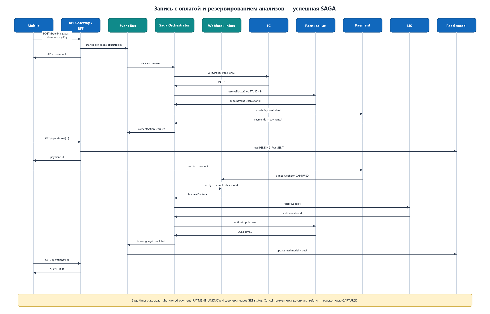

# Задание 3.2. Запись с оплатой и резервированием анализов

## Успешный сценарий

1. Мобильное приложение отправляет команду создания комплексной записи с `Idempotency-Key`.
2. External API Gateway/WAF проверяет access token, а BFF атомарно регистрирует ключ и создаёт `operationId`.
3. BFF публикует команду `StartBookingSaga` в событийную платформу и сразу возвращает `202 Accepted` с `operationId`.
4. Оркестратор SAGA в интеграционной платформе получает команду и через соответствующий legacy-адаптер проверяет полис в 1С. Положительный результат не изменяет состояние, поэтому отдельная компенсация не нужна.
5. Оркестратор резервирует слот врача в сервисе расписания, передавая стабильный ключ `operationId:appointment`. Hold создаётся с TTL **15 минут** (стартовое значение, уточняемое по метрикам времени оплаты); дедлайн сохраняется в состоянии SAGA.
6. Оркестратор создаёт payment intent с ключом `operationId:payment` и через событие обновляет read-модель операции; приложение получает `paymentUrl` при чтении статуса.
7. Приложение подтверждает оплату на защищённой странице платёжного провайдера. Платёжный шлюз присылает подписанный webhook, который дедуплицируется по inbox и сообщает оркестратору финальный статус `CAPTURED`.
8. После успешной оплаты оркестратор резервирует время забора биоматериала в LIS с ключом `operationId:lab`.
9. Получив `labReservationId`, оркестратор подтверждает запись врача командой `confirmAppointment(appointmentReservationId, operationId:appointment-confirm)`, превращая временный hold в окончательную запись.
10. Только после подтверждения записи оркестратор публикует `BookingSagaCompleted`; подписчики обновляют read-модель и отправляют push, после чего приложение получает итоговый статус `SUCCEEDED`.

Редактируемый исходник PlantUML: [booking-saga.puml](booking-saga.puml).

## Выбор типа SAGA

Выбрана **оркестрируемая SAGA**, потому что процесс имеет строгий порядок, включает финансовую операцию и должен явно управлять таймаутами и компенсациями. Оркестратор является компонентом интеграционной платформы, хранит состояние процесса и вызывает 1С, расписание, платёжный шлюз и LIS через изолирующие адаптеры. Это упрощает аудит, поддержку и отображение пациенту единого статуса операции. Недостаток в виде центрального компонента компенсируется stateless-экземплярами оркестратора и персистентным журналом SAGA, позволяющим продолжить процесс после перезапуска.

Локальная транзакция состояния SAGA и команда следующего шага фиксируются через transactional outbox. Входящие webhook и ответы адаптеров проходят через inbox, поэтому повтор сообщения не переводит процесс в новое состояние второй раз. Таймаут означает «результат пока неизвестен», а не автоматический отказ: перед компенсацией оркестратор сначала запрашивает фактический статус шага по `operationId`.

### Таймауты и неопределённый статус оплаты

При создании hold оркестратор ставит персистентный saga timer на дедлайн оплаты, совпадающий с TTL hold (первоначально 15 минут). Если к дедлайну нет подтверждённой оплаты, это считается abandoned payment: SAGA прекращает ожидание клиента и проверяет платёжный шлюз через `GET /payment-intents/{paymentId}`. Таймер и его обработчик идемпотентны; поздний webhook всё равно проходит через inbox и сверяется с текущим состоянием.

Если запрос статуса завершился таймаутом, сетевой ошибкой или провайдер вернул нефинальный ответ, SAGA переходит в `PAYMENT_UNKNOWN` и запускает reconciliation с ограниченным exponential backoff и jitter. Переходы state machine:

- `CAPTURED` → зафиксировать успешную оплату и продолжить резервирование LIS; если бизнес-дедлайн уже истёк и продолжение невозможно, выполнить refund и освободить hold;
- `FAILED` (включая `CANCELED`/`EXPIRED` провайдера) → зафиксировать отказ, идемпотентно освободить hold врача и завершить операцию как `FAILED`;
- `PENDING` → до бизнес-дедлайна остаться в `PAYMENT_UNKNOWN` и запланировать следующий `GET status`; на дедлайне перейти к `cancelPaymentIntent`, а если статус или результат отмены так и не удалось достоверно установить — после исчерпания окна reconciliation перевести операцию в `MANUAL_REVIEW`, не предполагая ни успех, ни отказ.

Если `GET status` подтверждает, что intent ещё не оплачен (`PENDING`/`REQUIRES_ACTION`) и дедлайн оплаты истёк, оркестратор вызывает идемпотентный `cancelPaymentIntent(paymentId, operationId:payment-cancel)`, затем освобождает hold. Если отмена возвращает конфликт из-за конкурентного списания, результат снова считается неизвестным и сверяется через `GET status`; `CAPTURED` никогда не компенсируется отменой intent.

### Проверка полиса в 1С

`verifyPolicy` является read-only вызовом. Адаптер выполняет короткие повторы только для транзиентных ошибок (ограниченный exponential backoff с jitter), защищает 1С circuit breaker-ом и использует локальную read-only проекцию полисов как деградированный источник. Проекция содержит время актуальности и источник данных: положительный результат из достаточно свежей проекции позволяет продолжить процесс по согласованному SLA, а отрицательный или устаревший результат не трактуется как недействительный полис — SAGA остаётся в ожидании, повторяет проверку после восстановления 1С либо уходит в `MANUAL_REVIEW`.

## Компенсирующие транзакции

| Шаг сценария | Компенсирующее действие | Устраняемый риск |
|---|---|---|
| Резервирование слота врача | Отменить hold/запись в расписании по `appointmentReservationId`; операция отмены идемпотентна | Слот не останется занятым, если оплата отклонена или резервирование лаборатории не выполнено |
| Создание неоплаченного payment intent | После истечения дедлайна и проверки `GET status` вызвать `cancelPaymentIntent` с ключом `operationId:payment-cancel` | Заброшенный intent нельзя будет оплатить после освобождения врачебного слота |
| Успешное списание оплаты | Создать полный refund по исходному `paymentId` с ключом `operationId:refund`; повторно сверять статус до финального результата | Пациент не потеряет деньги, если после оплаты не удалось завершить комплексную запись |
| Резервирование времени в LIS | Отменить резерв по `labReservationId`; если отмена временно недоступна, повторять через очередь и передать в ручную обработку после исчерпания попыток | Лабораторный слот не останется занятым при сбое финализации или последующей отмене всей операции |

Компенсации выполняются в обратном порядке завершённых шагов: LIS → платёж → расписание. Они также являются шагами SAGA, имеют собственные статусы и повторы. Если автоматическая компенсация исчерпала лимит попыток, процесс получает статус `MANUAL_REVIEW`, формируется алерт, а пациенту не показывается ложное подтверждение.

> `cancelPaymentIntent` и refund не взаимозаменяемы: cancel применяется только к гарантированно неоплаченному intent, а после статуса `CAPTURED` выполняется только refund. При неизвестном статусе сначала обязательна reconciliation-проверка `GET status`.

## Идемпотентность на входе

Клиент генерирует UUID в заголовке `Idempotency-Key` для одной логической команды и сохраняет его до получения определённого результата. Повтор после таймаута, потери сети или двойного нажатия отправляется с тем же ключом; для новой попытки записи после явной отмены создаётся новый ключ.

BFF хранит запись с уникальным ограничением `(patientId, endpoint, idempotencyKey)`:

- хеш нормализованного тела запроса;
- `operationId` и состояние `IN_PROGRESS | SUCCEEDED | FAILED`;
- HTTP-код и тело окончательного ответа;
- срок хранения, превышающий максимальное время SAGA и допустимое окно повтора.

Регистрация ключа и создание операции выполняются атомарно. Если ключ новый, BFF возвращает `202 Accepted` с `operationId`; для выполняющегося запроса с тем же телом возвращает тот же `operationId`, а после завершения — сохранённый итоговый ответ. Использование того же ключа с другим телом отклоняется кодом `409 Conflict`. Стабильный `operationId` образует производные ключи для расписания, платёжного шлюза, LIS, webhook inbox и компенсирующих операций, поэтому повтор на любом участке не создаёт вторую запись, списание или резерв.
