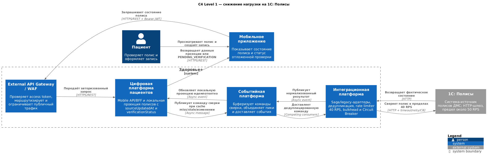

# Задание 4.1. Отказоустойчивость интеграций

Паттерны отказоустойчивости применяются в адаптерах интеграционной платформы, а не в мобильном приложении или BFF. Так единые timeout, retry, Circuit Breaker, rate limiter и метрики защищают legacy- и внешние системы независимо от канала, который инициировал операцию.

## Параметры вызовов

| Система | Timeout | Retry | Fallback | Обоснование |
|---|---|---|---|---|
| **1С: Полисы** | **2 с на попытку** | Не более **1 повторной попытки** через случайный интервал **200–500 мс**. Только для безопасной операции проверки полиса; `4xx` и ошибки контракта не повторяются | Сначала использовать свежую локальную проекцию. При недоступности 1С вернуть последнее известное значение с `verificationStatus=PENDING_VERIFICATION`; при отсутствии данных — только `PENDING_VERIFICATION`, но не ложное «полис недействителен» | Сейчас 1С зависает более чем на 30 с и перестаёт отвечать при нагрузке свыше 50 RPS. Короткий timeout освобождает ресурсы адаптера, а единственный retry покрывает кратковременный сетевой сбой, не создавая retry storm |
| **Платёжный шлюз** | **3 с на создание payment intent** | **1 повторная попытка** через **500 мс + jitter 0–250 мс**, обязательно с тем же `operationId:payment`/идемпотентным ключом. Автоматически не повторять списание, capture или refund без гарантии идемпотентности провайдера | Вернуть `PAYMENT_PENDING` и продолжить сверку по подписанному webhook и запросу статуса по `paymentId`. Не показывать «платёж отклонён», пока фактический результат неизвестен | После сетевого таймаута деньги могут быть уже списаны. Повтор допустим только для идемпотентного создания intent; финансовый результат определяется асинхронно, а не по факту получения синхронного ответа |

Приведённые значения являются стартовой конфигурацией. Их следует уточнить по latency histogram, допустимому SLO завершения SAGA и нагрузочным тестам. Общий бюджет повторов ограничивается deadline операции: библиотека resilience не должна начинать новую попытку, если оставшегося времени недостаточно для её timeout.

## Circuit Breaker

Circuit Breaker приоритетно внедряется для **1С: Полисы**. У этой системы известен жёсткий предел около 50 RPS и длительные зависания, поэтому неограниченные вызовы и повторы быстро занимают все worker threads и соединения интеграционной платформы, после чего отказ распространяется на остальные сценарии. Для платежей Circuit Breaker также нужен, но главную финансовую проблему там решают идемпотентный payment intent, подписанный webhook и сверка статуса: сам Circuit Breaker не определяет, произошло ли списание.

Стартовая политика для адаптера 1С:

- **Closed:** запросы проходят в 1С; учитываются ошибки, timeout и медленные вызовы дольше 2 секунд.
- Используется скользящее окно **20 вызовов** с минимальным объёмом **10**. При доле неуспешных/медленных вызовов **50%** либо после **5 последовательных ошибок** breaker переходит в Open.
- **Open:** в течение **30 секунд** новые вызовы немедленно получают fallback без обращения к 1С. Отдельный rate limiter ограничивает поток в 1С значением **40 RPS**, оставляя запас до известного предела, а bulkhead допускает не более **20** одновременных запросов.
- **Half-Open:** разрешаются **3 пробных вызова**. Три успеха закрывают breaker; любая ошибка снова открывает его на 30 секунд.
- Ручное принудительное закрытие не используется: оно способно вернуть каскадный отказ. Оператор может только продлить Open или отключить конкретную интеграцию через контролируемую конфигурацию.

Для платежного адаптера применяется отдельный breaker, чтобы отказ провайдера не влиял на 1С и LIS. Открытие breaker запрещает создание новых intent, но не останавливает приём webhook и фоновую сверку уже начатых платежей.

Обязательные метрики и алерты: состояние и число переходов breaker, failure/slow-call rate, число отклонений rate limiter и bulkhead, latency по попыткам, доля fallback, возраст данных проекции, число `PENDING_VERIFICATION`/`PAYMENT_PENDING` и результат последующей сверки.

## Снижение нагрузки на 1С

Выбрано развитие решения `ARCH-REL-012`: **локальная проекция полисов с cache-first чтением и контролируемой асинхронной синхронизацией**.

1. Цифровая платформа пациентов читает сведения о полисе из собственной проекции и не выполняет fan-out в 1С при каждом открытии экрана.
2. Свежими считаются данные, обновлённые не более 15 минут назад. Изменение полиса и cache miss создают команду сверки в событийной платформе.
3. Конкурирующие consumers объединяют одинаковые запросы по `patientId/policyId`; адаптер применяет rate limit 40 RPS, bulkhead и Circuit Breaker.
4. Нормализованный результат публикуется как версионированное событие и идемпотентно обновляет проекцию.
5. При сбое пользователь видит последнее известное состояние с признаком отложенной проверки. Решение об оказании услуги, требующее актуального подтверждения, завершается только после сверки с системой-источником.

Очередь выравнивает пики, но не превращает устаревшие данные в достоверные. Для проекции фиксируются `sourceUpdatedAt`, `syncedAt`, версия и статус верификации; задаются максимальный возраст stale-данных и процедура ручной сверки.

## C4 Level 1

Редактируемый исходник PlantUML: [insurance-load-reduction.puml](insurance-load-reduction.puml).
