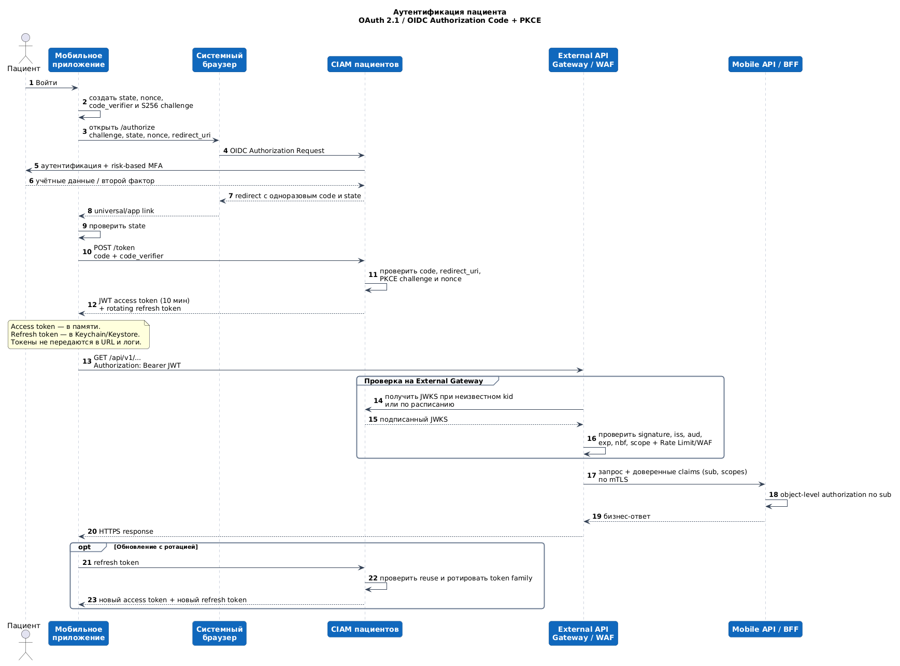

# Задание 4.3. Базовые меры безопасности

## Аутентификация мобильного приложения

Для пациентов используется **OAuth 2.1 / OpenID Connect Authorization Code Flow с PKCE (`S256`)** через CIAM. Мобильное приложение является public client и не содержит `client_secret`: извлечённый из приложения секрет нельзя считать конфиденциальным.

1. Приложение создаёт криптографически случайные `state`, `nonce` и `code_verifier`, вычисляет `code_challenge=S256(code_verifier)` и открывает системный браузер на `/authorize`.
2. CIAM аутентифицирует пациента; для регистрации, восстановления доступа, подозрительного устройства и рискованных операций применяется MFA/step-up. Пароль вводится только на странице CIAM и не попадает в приложение.
3. CIAM возвращает одноразовый authorization code через зарегистрированный universal/app link. Приложение проверяет `state` и обменивает code вместе с `code_verifier` на токены по защищённому back-channel.
4. Короткоживущий JWT access token, например на **10 минут**, передаётся только в заголовке `Authorization: Bearer <token>` по HTTPS. Access token хранится в памяти; refresh token с ротацией — в iOS Keychain/Android Keystore.
5. External API Gateway/WAF локально проверяет подпись JWT по кешированному JWKS, а также `iss`, `aud`, `exp`, `nbf` и scopes. При неизвестном `kid` ключи обновляются из CIAM; недоступность CIAM не требует сетевого вызова на каждый API-запрос.
6. BFF получает идентификатор пациента из доверенного claim `sub`, а не из query/body, и выполняет объектную авторизацию для каждой записи и медицинского результата.
7. При обновлении CIAM ротирует refresh token и блокирует всю token family при повторном использовании старого токена. Logout отзывает refresh token и очищает защищённое хранилище; короткий TTL ограничивает время жизни уже выданного access token.

Редактируемый исходник PlantUML: [mobile-auth.puml](mobile-auth.puml).

## Rate Limiting

Лимиты реализуются на External API Gateway/WAF распределённым token bucket. Они являются стартовыми и уточняются нагрузочными тестами и реальным профилем клиентов. Внутренние лимиты concurrency и backpressure BFF остаются дополнительной защитой и не заменяют внешний rate limit.

| Тип запроса | Лимит | Действие при превышении |
|---|---|---|
| **Публичный запрос «Поиск врачей»** | **60 запросов в минуту на IP + app-instance**, burst до **10 запросов**. Дополнительно — общий лимит на IP/подсеть и WAF reputation, чтобы один меняющийся instance ID не обходил защиту | Вернуть `429 Too Many Requests` и `Retry-After`; не обращаться к BFF. Повторные нарушения увеличивают время блокировки, а подозрительный трафик получает challenge/временную блокировку WAF. Успешные одинаковые запросы кратковременно кешируются |
| **Авторизованный запрос «Создание записи к врачу»** | **5 новых операций в минуту на `sub` пациента**, burst **2**, и не более **1 выполняющейся операции на один `Idempotency-Key`**. Защитный лимит **20 запросов в минуту на IP** применяется дополнительно | Для новой операции сверх лимита вернуть `429` и `Retry-After`, не создавая команду SAGA. Повтор с тем же `Idempotency-Key` и тем же телом возвращает существующий `operationId`/результат и не считается новой бизнес-операцией; слишком частый транспортный polling ограничивается отдельно |

Ключи лимитов нельзя строить только по IP: мобильные операторы используют общий NAT. Для анонимного поиска комбинируются IP, выданный приложению installation ID и сигналы WAF; для авторизованной команды основным ключом является проверенный `sub`. Заголовки от клиента с якобы готовым `patientId` не используются.

## Защита данных при передаче

1. **TLS везде.** Внешние API принимают только TLS 1.2+ с предпочтением TLS 1.3 и современными cipher suites; HTTP и устаревшие протоколы отключены. Для доменов веб-аутентификации включён HSTS.
2. **Проверка сертификата.** Приложение использует системную проверку цепочки и hostname, запрещает cleartext traffic и не предоставляет пользователю обход ошибок сертификата. Если применяется pinning, фиксируется SPKI с резервным ключом и заранее проверенной процедурой ротации, а не один конечный сертификат.
3. **Защищённый внутренний участок.** После завершения внешнего TLS на Gateway каждый следующий hop использует новый TLS; для Gateway → BFF и service-to-service применяется mTLS с короткоживущей workload identity и автоматической ротацией сертификатов.
4. **Безопасная передача токенов.** Access token передаётся только в `Authorization` header, никогда в URL, query, Referer, analytics и push. Refresh token не отправляется бизнес-API и хранится только в защищённом хранилище ОС.
5. **Защита OAuth-потока.** Обязательны PKCE `S256`, точное сопоставление redirect URI, `state`, `nonce`, одноразовый короткоживущий code и запрет embedded WebView. Universal/app links должны быть привязаны к подписанному приложению.
6. **Авторизация и минимальные права.** Gateway проверяет токен и scope, BFF выполняет object-level authorization по `sub`; внутренние сервисы получают отдельные service credentials. Customer IAM физически и логически отделён от корпоративного IAM сотрудников.
7. **Защита от инъекций.** Gateway/BFF валидируют запросы по схеме, ограничивают размер и тип содержимого; backend использует параметризованные запросы. WAF является дополнительным барьером, но не заменяет безопасный доступ к БД.
8. **Webhook и replay protection.** Webhook платёжного провайдера проверяется по подписи, timestamp и уникальному event ID; старые и повторные события отклоняются либо идемпотентно возвращают прежний результат.
9. **Минимизация утечек.** Персональные и медицинские данные, токены и платёжные реквизиты редактируются в логах, трассировках и сообщениях об ошибках. Push содержит только нейтральный сигнал о готовности данных.
10. **Аудит и реагирование.** Входы, refresh/revoke, отказы авторизации, rate-limit и административные действия журналируются с `requestId/correlationId`, но без секретов. Метрики поступают в централизованную платформу наблюдаемости и формируют алерты по аномалиям.

Шифрование at rest и управление ключами также обязательны для медицинских данных, но не заменяют перечисленную защиту каждого сетевого участка.
